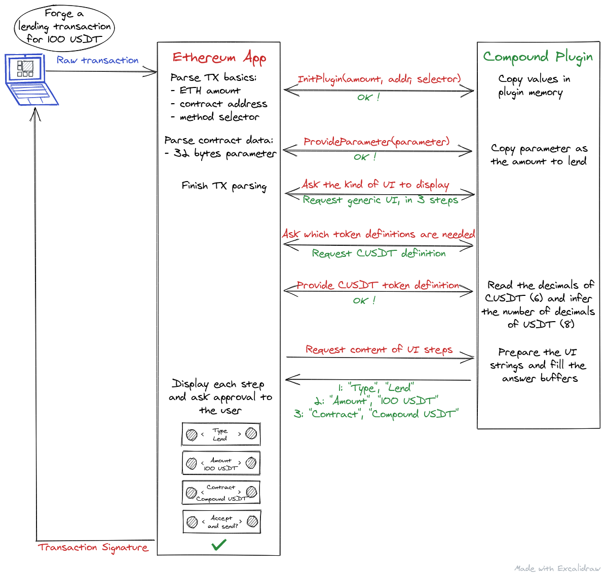

# Ethereum plugins

_A new frontier for the security of human interactions with smart contracts_

## Smart Contracts?

Unlike with Bitcoin, where most transactions are simple value transfers from an address to another, Ethereum transactions often contains interactions with `Smart Contracts`, which are programs running on its blockchain. Every time someone lends coins on [`Compound`](https://compound.finance/), swap some tokens on [`Uniswap`](https://uniswap.org/) or pet his [`Cryptokitties`](https://www.cryptokitties.co/), smart contract transactions are involved. Supporting these use cases on hardware wallets is essential to sustain the growth of the Ethereum ecosystem without making compromises on its security.

## Previous state of smart contract support

Until now, the Ethereum app was only able to interact with `ERC20` smart contracts in a really secure fashion, i.e displaying on the device screen the action that is ongoing in the transaction being signed. All the others smart contracts were kind of second-class citizens: it was possible to interact with any of them, but the device would just let you know that some action was happening, skipping all interpretation and letting the user approve blindly, at his own risk.

<figure class="image">
  
  <figcaption>Current Ethereum UI when signing a transaction that interacts with an unsupported smart contract</figcaption>
    
</figure>

## Supporting all smart contracts used to be hard

Adding full support for any given smart contract available in the wild proved hardly feasible for many reasons:

- it required too much knowledge of the Ethereum app’s codebase for third party developers to be interested
- even if they did, adding full support for many smart contracts would not scale, both in term of flash space used and technical debt added to the application parsing logic

## Introducing Ethereum plugins:

With the release of `Ethereum app v1.5.0`, we are laying the foundation to make adding support for a full smart contract on Ledger products much easier and scalable.
To do so, the Ethereum transaction parser is now hookable by a new kind of applications: plugins.
Plugins are small applications dedicated to parsing custom transaction fields and building a custom display to show on screen to the user. They can be installed just like any other app but they don’t appear on the device dashboard, and are very lightweight in size. You have to install only the plugins for the smart contracts you plan to interact with, so it is much more scalable than previously when all the code logic for every smart contract was stored in the Ethereum app, even if most users had few or no use for it.

<figure class="image">
  
  <figcaption>Memory is a scarce resource, especially on Nano S where just a few apps can be installed before reaching its limits</figcaption>
    
</figure>

There are only a few plugins available at the time of this writing (`ERC20`, `Compound`, `Starkware`), but we hope to have plugins available for every major Ethereum smart contract in a near future: this depends on Ledger, but also on Ledger's community. By lowering the entry bar to adding smart contract support, we hope to get traction from smart contract programmers so they too, embrace the security of hardware wallets.

## Case overview: the Compound plugin

Compound is a well known set of DeFi smart contracts allowing people to lend and borrow cryptocurrencies in a trustless fashion on the Ethereum blockchain. We recently added support for Compound lending operation and we’re going to present a schematized overview of the flow of a lending transaction processing assisted by a plugin.

This schema might seem a little bit complex at first sight, but there's actually only very little code written to implement it. Every interaction between the Ethereum app and the Compound plugin are pre-defined hooks that a programmer just has to fill with his custom processing logic. This processing logic is often very simple:

- Copying some values to format them later
- Making basic security checks
- Preparing some buffers to display an approval UI to the user
- etc.

Hence, a plugin is often a [single file](https://github.com/LedgerHQ/app-ethereum/blob/eth2_deposit/src_plugins/compound/compound_plugin.c)!

## 🦄 Build your own Ethereum plugin

To implement a plugin for your smart contract, you can start by forking [plugin-boilerplate](https://idontyetexist.com). A documentation of all the hooks and their role is available [there](https://github.com/LedgerHQ/app-ethereum/blob/eth2_deposit/doc/ethapp_plugins.asc), and you can also get inspiration from the plugins already available on [github](https://github.com/LedgerHQ/).

Having a Ledger device to test your code is not even necessary thanks to [speculos](https://blog.ledger.com/speculos/), the ledger emulator.
If you're new to the Ledger development community, you can also find the basics of the BOLOS platform on [readthedocs](https://ledger.readthedocs.io/en/latest/userspace/getting_started.html). You can also reach to us on our developper Slack by requesting access to it [here](https://support.ledger.com/hc/en-us/requests/new)

## Conclusion

Ethereum plugins are a new and powerful yet simple way to improve the security and usability of smart contracts using Ledger hardware wallets, and we hope you'll enjoy them, and eventually that some of you will even try to build their own.
We are commited to improve and maintain a fertile ground for their development so Ethereum DApps can continue to grow and thrive, securely.


